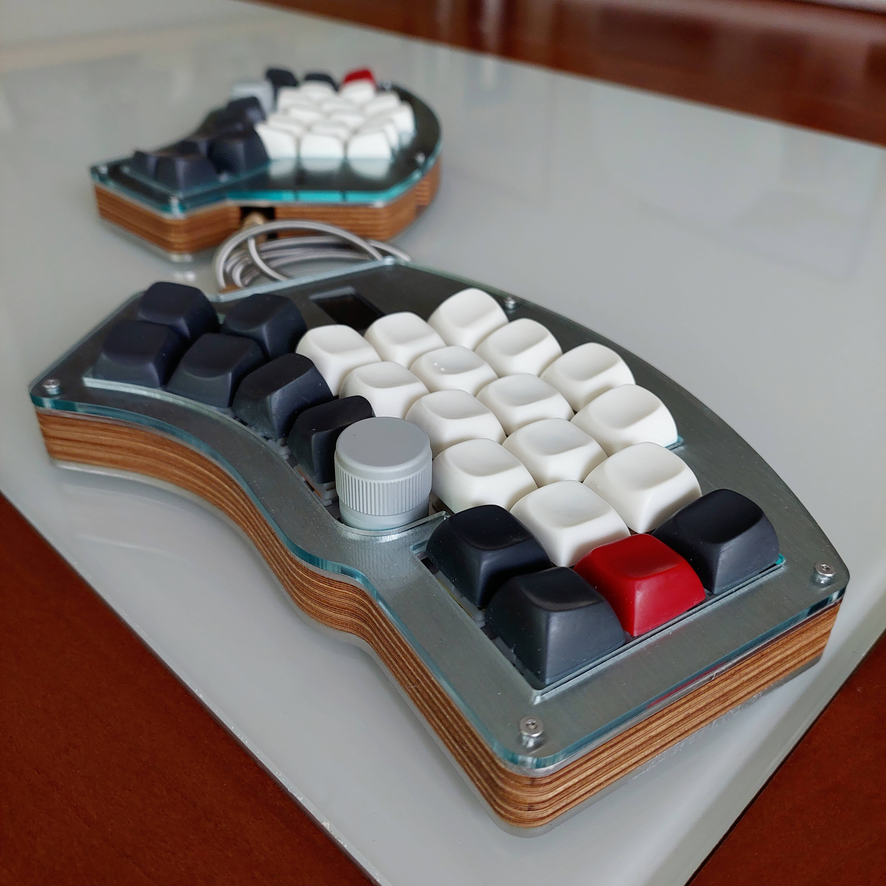
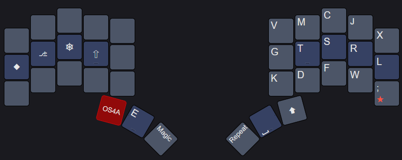

# Kawamashi’s QMK configuration

This is a template repository which allows for an external set of QMK keymaps to be defined and compiled. This is useful for users who want to maintain their own keymaps without having to fork the main QMK repository.



## Custom features
* [Configuration des Layer-Tap](#Configuration-des-Layer-Tap)
* [One-shot for All](#one-shot-for-all-mods) modifiers
* [Modificatrices](#Modificatrices)
* [Mod Word](#Mod-Word)
* [Layer Word](#Layer-Word)
* [Clever Keys](#Clever-Keys)

&nbsp;</br> &nbsp;</br>

## Configuration des Layer-Tap
J’utilise des layer-tap sur mes touches de pouces pour accéder aux couches dont je me sers le plus (symboles, chiffres, navigation, raccourcis et modificatrices).


J’utilise le [Permissive Hold](https://docs.qmk.fm/tap_hold#tap-or-hold-decision-modes), qui me permet de ne pas avoir à attendre le *tapping term* en cas de nested tap. Grâce à ça, je n’ai plus de faux‑négatifs avec mes layers‑tap. 


Pour éviter les déclenchements par erreur (lors de roulements par exemple), je me base sur une vérification de la position des touches : avant le typing_term, si l’une de mes touches de pouce principales est enfoncée ainsi qu’une autre touche de la même main, alors la touche de pouce produira immédiatement un tap et non un hold. Pour cela, j’ai adopté l’approche de [Filterpaper](https://github.com/filterpaper/qmk_userspace?tab=readme-ov-file#contextual-mod-taps), que je trouve légère et efficace. Elle est basée sur l’utilisation de la fonction `pre_process_record_user` et sur une utilisation avancée de la fonction `get_hold_on_other_key_press` :

```c
bool pre_process_record_user(uint16_t keycode, keyrecord_t *record) {

    if (record->event.pressed) {
        // Cache the next input for mod-tap decisions
        next_keycode = keycode;
        next_record  = *record;
    }
    return true;
}
```
```c
bool get_hold_on_other_key_press(uint16_t keycode, keyrecord_t *record) {

    if (!approved_chord(keycode, record, next_keycode, &next_record)) {
        // When a layer-tap key overlaps with another key on the same hand, send its base keycode.
        record->tap.interrupted = false;
        record->tap.count = 1;
        return true;
    }
    return false;
}
```
&nbsp;</br> &nbsp;</br>

## Modificatrices
Pour les modificatrices, je n’utilise pas de Home-row Mods à proprement parler. Mes modificatrices sont des [Callum mods](https://github.com/callum-oakley/qmk_firmware/tree/master/users/callum), autrement dit des one-shot mods situés sur la rangée de repos d’une couche spécifique. J’aime cette approche qui ne produit pas de délai dans l’affichage des frappes, contrairement aux HRM. 


Les Callum mods peuvent être maintenus comme des modificatrices classiques, ou employés comme sticky keys. Ils ont la particularité de ne pas utiliser de timer. Du coup, ils peuvent être combinés sans être obligé de marquer une pause entre chaque modificatrice.


J’ai modifié le code de Callum Oakley pour corriger un bug qui affectait les roulements. J’ai également implémenté un timer, pour que les one-shot mods se désactivent automatiquement au bout d’un certain temps d’inactivité. Le code se trouve [ici](keyboards/splitkb/kyria/rev1/base/keymaps/Kawamashi/features/oneshot.c).

&nbsp;</br>

## One-shot for All (OS4A)
Les Callum mods sont placés sur des layers secondaires. Je n’aime pas le fait de devoir maintenir une touche pour y accéder, je voulais pouvoir le faire avec une one-shot layer. De plus, je voulais conserver des one-shot shift sur ma keymap, et je n’avais pas la place de tout mettre. J’ai donc conçu les One-Shot for All pour tout faire à la fois : 
- lors d’un appui maintenu, ces touches produisent `Shift`
- après un appui simple, elles activent une autre couche.

Sur la moitié de celle-ci, on trouve les modificatrices, qui peuvent être enchaînées les une avec les autres. Sur l’autre moitié, on retrouve les alphas. En cas d’appui sur une lettre, celle-ci sera shiftée et la couche sera désactivée. On retrouve ainsi le comportement d’un one-shot shift. J’ai une touche OS4A pour chaque moitié du clavier, voilà un exemple de couche OS4A :



- Pour taper `T` (majuscule), il suffit de taper `OS4A` `T`.
- Pour faire `Ctrl S`, on tape `OS4A` `⎈` `S`.
- Pour faire `Ctrl Shift T`, on tape `OS4A` `⎈` `⇧` `S`. L’ordre des modificatrices n’est pas importante, elles peuvent même être tapées simultanément.

Les OS4A fonctionnent grâce à des couches préfixées et à des [Layer Word](#Layer-Word). Les OS4A impliquent des timers, puisqu’au fond ce sont des mod-taps modifiés. Cependant, grâce à la configuration des [Tap-Hold](#Configuration-des-Layer-Tap), on peut faire un roulement sur `OS4A` et une modificatrice sans aucun souci. En utilisation réelle, il n’y a pas de timer à respecter. 

&nbsp;</br>

## Mod Word
Ce [module](keyboards/splitkb/kyria/rev1/base/keymaps/Kawamashi/features/modword.c) chapeaute mon implémentation de [*Caps Word*](https://docs.qmk.fm/features/caps_word), *Caps List*, *Caps Lock* et *Word Selection*.
### Caps List
J’utilise énormément [*Caps Word*](https://docs.qmk.fm/features/caps_word), et je suis régulièrement amené à écrire des listes de noms en majuscule, comme par exemple `QMK, ZMK et KRK`. J’ai donc développé *Caps List*, une fonctionnalité qui réactive *Caps Word* entre chaque mot d’une liste. 


L’utilisateur peut définir les keycodes qui ne doivent pas interrompre *Caps List* (comme par exemple les lettres, les chiffres, certains symboles, `,` et ` `). À la saisie d’un caractère différent, Caps List se désactivera automatiquement. L’utilisateur doit également définir les séparateurs de liste (comme `, `, ` et `, ` ou `). *Caps List* réactivera automatiquement *Caps Word* après l’un de ces séparateurs. 


Pour chaque séparateur, l’utilisateur peut définir un compteur, pour indiquer à la fonction qu’elle doit se désactiver après le prochain mot. Par exemple, ` et ` déclenche ce compteur mais pas `, `. 
&nbsp;</br>

### Mod Word
En plus de *Caps Word* et *Caps List*, je suis également amené à utiliser *Caps Lock* régulièrement. Je voulais que l’activation d’une fonctionnalité désactive automatiquement les autres, pour qu’il n’y ait pas d’interférences entre elles. Le module *Mod Word* est là pour les chapeauter. En plus de gérer les activations concurrentielles, *Mod Word* désactive la fonctionnalité en cours au bout d’un certain temps d’inactivité du clavier.
&nbsp;</br>

### Word Selection
*Word Selection* est une macro QMK qui permet de sélectionner un mot, et qui ajoute automatiquement shift (et contrôle si nécessaire) aux touches de navigation (flèches, home et end) tapées ensuite pour étendre la sélection. *Word Selection* supporte les changements de direction lors de la sélection, ce qui rend son utilisation très intuitive. 
Cette macro existe aussi sous la forme de *Line Selection*, qui sélectionne une ligne entière. 


*Word Selection* ajoutant une modificatrice aux inputs successifs, elle est également chapeautée par *Mod Word*.

&nbsp;</br>

## Layer Word
[*Layer Word*](keyboards/splitkb/kyria/rev1/base/keymaps/Kawamashi/features/layerword.c) est un concept similaire à *Caps Word*, mais il s’applique aux couches. Quand on active un *Layer Word*, on active la couche correspondante, et elle restera activée tant que l’utilisateur ne tape pas de caractère “word breaking”. Par exemple, le *Layer Word* lié à ma couche de nombres restera activé tant que je taperai des symboles numériques. Les caractères permettant de continuer chaque *Layer Word* sont à définir par l’utilisateur.


Comme pour *Mod Word*, il ne peut y avoir qu’un seul *Layer Word* actif à la fois. Les *Layer Word* peuvent se désactiver automatiquement au bout d’un certain temps d’inactivité du clavier.

&nbsp;</br>

## Clever Keys
Je me suis beaucoup inspiré de [ce post](https://getreuer.info/posts/keyboards/triggers/index.html#based-on-previously-typed-keys) quand j’ai écrit les [Clever Keys](keyboards/splitkb/kyria/rev1/base/keymaps/Kawamashi/features/clever_keys_utilities.c). Ce concept repose sur le fait de mémoriser les derniers caractères tapés en les stockant dans un buffer, et de potentiellement remplacer un caractère en cours de traitement par un autre. En un mot, les *Clever Keys* permettent de transformer votre layout en **layout adaptatif**.

```c
void process_clever_keys(uint16_t keycode, keyrecord_t* record) {

    if (record->event.pressed) {
      uint16_t ongoing_keycode = get_ongoing_keycode(keycode, record);

      if (ongoing_keycode != KC_NO) {
        get_clever_keycode(&ongoing_keycode, record);
        store_keycode(ongoing_keycode, record);
      }

    } else if (processingCK) {    // On keyrelease
      processingCK = false;
      record->keycode = recent[RECENT_SIZE - 1];
    }
}
```

Dans un premier temps, l’algorithme analyse la frappe en cours pour déterminer si elle sert à taper un caractère ou pas. Par exemple, une touche de navigation ou une touche affectée par Ctrl ou Alt ne sert pas à taper du texte. Elle ne sera donc pas mémorisée, et effacera le contenu du buffer pour éviter des effets de bord potentiellement catastrophiques. Cette fonction est paramétrable par l’utilisateur. 


Quand le résultat d’une frappe est un caractère, une [autre fonction](keyboards/splitkb/kyria/rev1/base/keymaps/Kawamashi/clever_keys.c) (également paramétrable par l’utilisateur) détermine si celui-ci doit être remplacé (par un autre caractère ou par une macro) ou bien si d’autres caractères doivent être insérés avant lui, en fonction du contenu du buffer. Celui-ci mémorise les 8 dernières touches. Enfin, le caractère est ajouté au buffer, en décalant les touches présentes auparavant. Pour éviter des effets intempestifs, le buffer se vide automatiquement au bout d’un certain temps d’inactivité du clavier.


Les Clever Keys me servent notamment :
- à ajouter automatiquement le `U` entre le `Q` et une autre voyelle (ou l’apostrophe)
- à mettre en majuscule la première lettre suivant une espace, lorsqu’elle est précédée par `.`, `?`, or `!`. Autrement dit, `Shift` s’applique automatiquement en début de phrase !
- à changer le comportement de la touche `Repeat` dans certaines circonstances. En français, je l’utilise aussi comme une touche [apostrophe](https://github.com/Kawamashi/Propergol/blob/main/README.md#pour-le-fran%C3%A7ais-et-langlais).
- à donner des effets “magiques” à n’importe quelle touche, pas seulement la touche `Alt-Repeat`
- à paramétrer plus finement celle-ci, en tenant compte de la série de touches tapées avant et non pas seulement de la dernière


`Backspace` supprime la dernière touche du buffer, et décale les touches dans l’autre sens. La touche `Repeat` interagit avec le buffer, même quand il est mis à jour avec `Backspace`. C’est comme si `Repeat` voyageait dans le temps !


Parfois, une Clever Key se déclenche, mais ce n’est pas le comportement souhaité. Dans ce cas, il suffit d’effacer les touches produites par l’algorithme, et celui-ci effacera complètement le buffer. Comme ça, si on retape le même caractère, les Clever Keys ne s’appliqueront pas ce coup-ci. Par exemple, si je tape `Q` puis `I`, je vais obtenir `QUI`. Si pour une fois je voulais taper `QI`, il me suffirait de taper deux fois `Backspace` pour effacer `UI` et de retaper `I` pour obtenir `QI`. J’ai également une macro *Panique* qui permet de vider le buffer, pour éviter que les Clever Keys ne modifient la frappe suivante.
